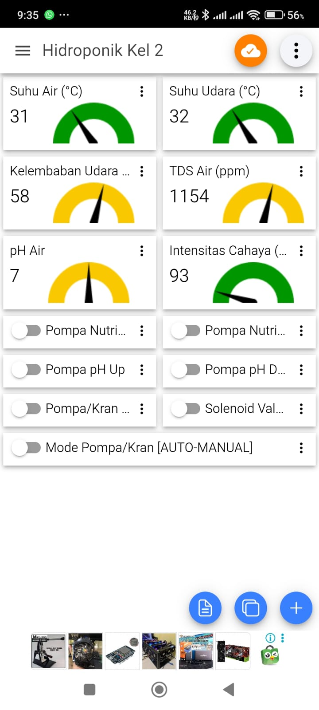

# 🌱 Smart Hydroponic Automation System V2

This project is an **IoT-based Smart Hydroponic System** developed during the *Project-Based Learning Hydroponic Automation System Training* organized by **BLKPP DIY** and **BPVP Surakarta**.

It uses **ESP32**, **various sensors (pH, TDS, DHT22, DS18B20, water level)**, and **MQTT** for real-time monitoring and automation of hydroponic systems.

---

## 🧩 System Overview
Here’s the complete view of the hydroponic automation setup:

The system includes:
- ESP32 microcontroller as the main controller  
- Sensors for pH, temperature, humidity, TDS, and water level  
- Pumps and solenoid valves for water and nutrient control  
- LCD 20x4 display for system data  
- WiFi and MQTT connectivity for remote monitoring  

---

## 📱 IoT MQTT Dashboard
The system sends telemetry data to an **IoT MQTT Panel App**, where users can monitor and control devices remotely.

Data displayed on the dashboard includes:
- Temperature & Humidity  
- Water Temperature  
- TDS (Nutrient Concentration)  
- pH Value  
- Pump status and alerts  

---

## ⚙️ Controller Interface
Local control panel allows manual operations and configuration of system parameters.

**Menus include:**
- Schedule setting  
- WiFi & MQTT configuration  
- Telemetry interval setting  
- Time & date setup  
- Manual control and water level configuration  

---

## 🧠 Key Features
- 🌡️ Real-time data monitoring  
- 🕒 Scheduled automation control  
- 🌊 Adjustable water level thresholds  
- 📶 WiFi + MQTT connection  
- 🖥️ LCD-based local display  
- 🔔 Buzzer for alerts and warnings  

---

## 🧾 License
This project was developed for educational purposes under **BPVP Surakarta & BLKPP DIY (2025)**.
